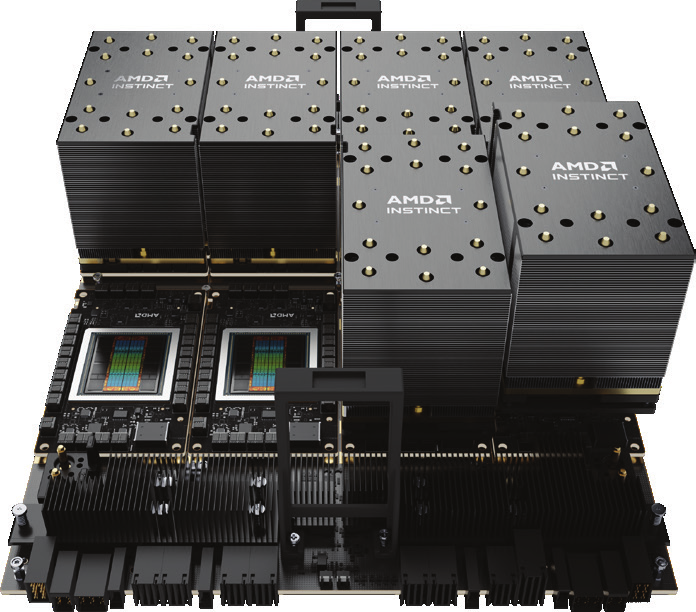

JADE\@ARC Facility User guide
############################

This is the documentation for the Joint Academic Data science Endeavour
(JADE) facility.

JADE\@ARC is a UK Tier-2 technology pilot resource, funded by EPSRC, owned and
hosted by the University of Oxford. The hardware was supplied and integrated by
Lenovo.

A consortium of UK universities, led by the University of Oxford, has been
awarded £5 million by the Engineering and Physical Sciences Research Council
(EPSRC) to  continue the world leading research enabled by the Joint Academic
Data science Endeavour (JADE) service. This forms part of a much larger
investment by EPSRC in the UK's regional Tier 2 high-performance computing
facilities, which aim to bridge the gap between institutional and national
resources.

JADE\@ARC Hardware
=============

JADE\@ARC hardware consists of:

- 3 Lenovo ThinkSystem SR685a V3 Nodes, each with

  - 2 AMD EPYC 9534 64-Core CPUs and
  - 8 AMD MI300X GPUs

- 2 Login nodes
- Mellanox NDR networking
- 32TB of local SSD scratch storage per node

.. toctree::
   :maxdepth: -1
   :hidden:

   jade/index
   software/index
   cuda
   more_info
   troubleshooting
